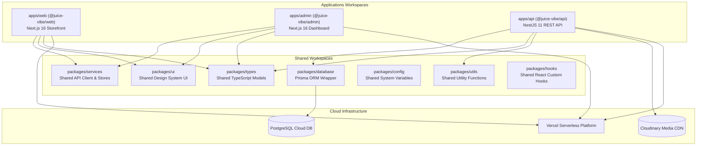

# 03. System Architecture Specification
**System:** Juice Vibe Digital Platform  
**Document Version:** 3.0.0-PROD  
**Author:** Dulanjaya Lakruwan  
**Date:** July 19, 2026  

---

## 1. Architectural Strategy & Design Principles

The **Juice Vibe Digital Platform** is architected as a modular Monorepo managed using **Turborepo** and **pnpm workspaces**. 

This structure allows the codebase to maintain absolute strict boundary isolation between application runtimes while sharing core business types, database schemas, utility functions, UI component libraries, and API service clients.



---

## 2. Directory Topology & Workspace Structure

```
juice-vibe-monorepo/
├── apps/
│   ├── web/                     # Next.js 16 Customer Storefront
│   ├── admin/                   # Next.js 16 Admin Operations Dashboard
│   └── api/                     # NestJS 11 REST API & WebSocket Server
├── packages/
│   ├── config/                  # Brand colors, SEO defaults, endpoints
│   ├── database/                # Prisma ORM schema and client exports
│   ├── hooks/                   # Custom React hooks (useOrdersSocket, etc.)
│   ├── services/                # Shared Axios API services & Zustand stores
│   ├── types/                   # Shared TypeScript interface models
│   ├── ui/                      # Shared design system components
│   └── utils/                   # Currency formatters, date helpers, cn utility
├── prisma/
│   ├── schema.prisma            # PostgreSQL Database Schema
│   └── seed.ts                  # Database seeding script (35 items)
├── docs/                        # Enterprise documentation package
├── turbo.json                   # Turborepo task pipeline configuration
├── pnpm-workspace.yaml          # PNPM Workspace packages definition
└── package.json                 # Monorepo root configuration
```

---

## 3. Technology Stack Reference

| Ecosystem Layer | Component | Version | Purpose & Description |
| :--- | :--- | :--- | :--- |
| **Monorepo Management** | Turborepo + PNPM | `^2.4.0` / `10.34.5` | Orchestrating workspace builds, caching, and task runs |
| **Customer Storefront** | Next.js + React | `16.2.10` / `19.2.4` | Client-facing portal, dynamic menu, QR ordering |
| **Admin Operations** | Next.js + React Query | `16.2.10` / `5.62.0` | Order desk Kanban/Grid/Table map, menu manager |
| **Backend API Service** | NestJS | `11.0.0` | REST API, Auth routing, WebSockets, Throttling |
| **Database & ORM** | PostgreSQL + Prisma ORM | `6.19.3` | Relational schema mapping and type-safe queries |
| **Styling & Animation** | Tailwind CSS v4 + Framer Motion | `v4.0` / `12.4.7` | Tropical design system, micro-animations |
| **Client State Store** | Zustand | `v5.0.0` | Persistent shopping cart & table QR state |
| **Media Pipeline** | Cloudinary SDK | `v2.5.1` | Cloud image uploads and CDN transformations |

---

## 4. Communication Protocols

1. **HTTP/REST Protocol**: Client web and admin apps communicate with `@juice-vibe/api` using standard JSON payloads over HTTPS.
2. **WebSocket Protocol**: The admin order desk establishes a persistent WebSocket connection to `apps/api` for real-time dispatch alerts when customers place orders.
