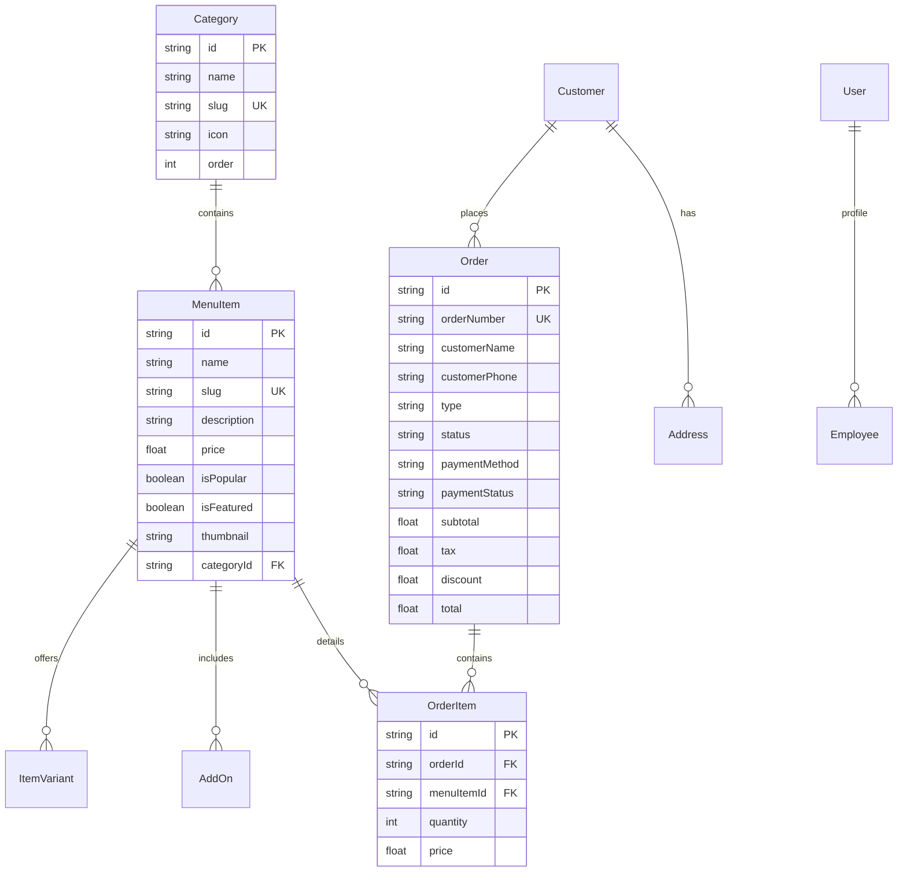

# 12. Database Schema & Data Dictionary Specification
**System:** Juice Vibe Digital Platform  
**Document Version:** 3.0.0-PROD  
**Author:** Dulanjaya Lakruwan  
**Date:** July 19, 2026  

---

## 1. Relational Entity-Relationship (ER) Architecture

The database is built on **PostgreSQL** using **Prisma ORM**.



---

## 2. Primary Database Entities

| Entity | Model Name | Description | Key Fields |
| :--- | :--- | :--- | :--- |
| **Users** | `User` | Authentication accounts & staff roles | `id`, `email`, `password`, `role` |
| **Categories** | `Category` | Menu categories (Milkshakes, Juices...) | `id`, `name`, `slug`, `order` |
| **Menu Items** | `MenuItem` | Food & drink items catalog | `id`, `name`, `slug`, `price`, `thumbnail` |
| **Item Variants** | `ItemVariant` | Size/flavor variants (Small, Large) | `id`, `name`, `priceAdjustment`, `menuItemId` |
| **Add-Ons** | `AddOn` | Extras (e.g. Add BOBA +100 LKR) | `id`, `name`, `price`, `menuItemId` |
| **Orders** | `Order` | Customer transactions & statuses | `id`, `orderNumber`, `type`, `status`, `total` |
| **Order Items** | `OrderItem` | Line items in an order | `id`, `orderId`, `menuItemId`, `quantity` |
| **Coupons** | `Coupon` | Promotional discount codes | `id`, `code`, `discountType`, `value` |
| **Testimonials** | `Testimonial` | Customer reviews & ratings | `id`, `name`, `rating`, `text`, `isApproved` |
| **Settings** | `Setting` | Global business configuration | `id`, `key`, `value` |

---

## 3. Database Migration Commands

- **Generate Prisma Client**:
  ```bash
  pnpm db:generate
  ```
- **Push Schema Changes to Cloud DB**:
  ```bash
  pnpm db:push
  ```
- **Seed Initial Data (35 Products & Admin User)**:
  ```bash
  pnpm db:seed
  ```
- **Launch Prisma Studio Database GUI**:
  ```bash
  pnpm db:studio
  ```
