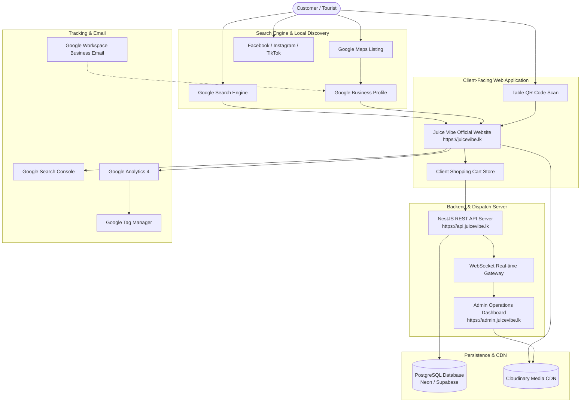

# DIGITAL BUSINESS INFRASTRUCTURE & OWNERSHIP HANDBOOK
**Client:** Juice Vibe Waskaduwa, Bentota, Sri Lanka  
**Lead Developer & Technology Advisor:** Dulanjaya Lakruwan (Full Stack Developer)  
**Date of Release:** July 19, 2026  
**Document Version:** 1.0.0-ENTERPRISE  
**Classification:** Official Commercial Client Handoff & Asset Ownership Specification  

---

## 1. EXECUTIVE SUMMARY

In the modern hospitality and food-service industry, a successful business requires far more than a basic static website. A business requires a **complete, integrated digital ecosystem**—a synchronized network of search engine visibility, local map discovery, cloud application hosting, real-time dispatch systems, analytics, and business communication channels.

This **Digital Business Infrastructure & Ownership Handbook** establishes a formal governance, legal, and operational framework for **Juice Vibe Waskaduwa**. It defines:
1. The exact inventory of digital assets created for the business.
2. Absolute client ownership rights versus developer technology management access.
3. Billing, security, and maintenance responsibilities.
4. Disaster recovery and long-term account governance.

> **Core Ownership Guarantee**: **Juice Vibe Waskaduwa** owns 100% of its domain names, business email accounts, customer data, Google Business listings, social media profiles, and application source code upon completion of final commercial payment. The developer acts solely as the technical architect and system manager.

---

## 2. BUSINESS DIGITAL ECOSYSTEM ARCHITECTURE

The diagram below illustrates how a prospective customer discovers Juice Vibe Waskaduwa, places an order, and how data flows through the infrastructure to café staff and analytics.



---

## 3. DIGITAL ASSETS INVENTORY MATRIX

This table catalogs all digital assets comprising the Juice Vibe digital presence, defining ownership, access levels, and billing responsibilities:

| Digital Asset | Business Purpose | Asset Owner | Developer Access | Renewal / Billing | Billing Owner |
| :--- | :--- | :--- | :--- | :--- | :--- |
| **Domain Name (`juicevibe.lk`)** | Primary brand Web URL address | Client | DNS Config Access | Annual | Client |
| **Google Workspace Account** | Primary administrative Google account | Client | Technical Delegate | Monthly / Annual | Client |
| **Business Emails (`hello@juicevibe.com`)** | Professional staff communication | Client | Account Manager | Included in Workspace | Client |
| **Google Business Profile** | Google Maps location listing & reviews | Client | Manager Role | Free | Client |
| **Google Analytics 4 (GA4)** | Website traffic & conversion analytics | Client | Editor Role | Free | Client |
| **Google Search Console** | Search indexing & SEO performance | Client | Full Owner Role | Free | Client |
| **Google Tag Manager** | Conversion tracking tag manager | Client | Admin Role | Free | Client |
| **GitHub Repository** | Application source code repository | Client (Post-Payment) | Admin Maintainer | Free | Client |
| **Vercel Serverless Hosting** | Web, Admin & API cloud deployment | Client | Technical Admin | Monthly (Free Tier) | Client |
| **Cloudinary Media Storage** | Product photos & gallery CDN storage | Client | API Integrator | Monthly (Free Tier) | Client |
| **Managed PostgreSQL DB** | Customer orders, catalog & users DB | Client | Database Admin | Monthly (Free Tier) | Client |
| **REST API Server** | Backend business logic & auth | Client | Full Access | Included in Vercel | Client |
| **SSL Certificate (HTTPS)** | Encryption & security lock icon | Client | Auto-Configured | Free (Auto-Renew) | Developer / Vercel |
| **Social Media Profiles** | Facebook, Instagram, TikTok | Client | Manager Access | Free | Client |
| **WhatsApp Business API** | Receipt links & direct messaging | Client | WhatsApp Link Sync | Free App | Client |

---

## 4. OWNERSHIP POLICY

### 4.1 Asset Ownership Principles
- **Client Ownership**: The Client (**Juice Vibe Waskaduwa**) holds 100% legal ownership of all domain names, brand assets, customer databases, revenue records, Google listings, and social media channels.
- **Source Code Ownership**: Upon complete payment of the agreed commercial development fee (**LKR 30,000.00**), full intellectual property ownership of the application codebase transfers permanently to the Client.
- **Developer Access Rights**: The Developer (**Dulanjaya Lakruwan**) retains administrative/manager access solely for development, maintenance, bug fixing, and support purposes.

---

## 5. DEVELOPER RESPONSIBILITIES

The Developer agrees to manage and maintain the technical infrastructure:

1. **Software Engineering**: Maintain high-quality Next.js 16, NestJS 11, and Prisma ORM application code.
2. **Production Deployment**: Manage Vercel serverless configurations, environment variables, and corepack settings.
3. **Infrastructure Monitoring**: Monitor site uptime, API response latencies, and database connectivity.
4. **Bug Fixing & Security Updates**: Provide technical resolution for software defects during active support contracts.
5. **Technical SEO Implementation**: Maintain sitemaps (`sitemap.xml`), robots rules (`robots.txt`), and Schema.org JSON-LD structured data.

---

## 6. CLIENT RESPONSIBILITIES

The Client agrees to fulfill business operational requirements:

1. **Domain & Subscription Renewals**: Timely payment for `.lk` domain renewals and any optional paid cloud subscriptions.
2. **Business Content & Pricing**: Maintaining accurate product pricing, menu descriptions, and operating hours via the Admin Panel.
3. **Google Review Management**: Actively collecting 5-star customer reviews and responding to feedback.
4. **Credential Security**: Keeping master Google Workspace passwords secure and enabling 2-Factor Authentication (2FA).

---

## 7. ACCOUNT CREATION & DEPLOYMENT WORKFLOW

The diagram below details the 10-step account creation and launch sequence:

```
[ Step 1: Client Master Google Account Setup (e.g. juicevibewaskaduwa@gmail.com) ]
                             │
                             ▼
[ Step 2: Register Domain Name (juicevibe.lk) at LK Domain Registry ]
                             │
                             ▼
[ Step 3: Setup Google Workspace & Business Email (hello@juicevibe.com) ]
                             │
                             ▼
[ Step 4: Claim & Verify Google Business Profile (Google Maps Listing) ]
                             │
                             ▼
[ Step 5: Provision Cloud Database (Neon / Supabase PostgreSQL) ]
                             │
                             ▼
[ Step 6: Configure Cloudinary Media CDN Account ]
                             │
                             ▼
[ Step 7: Link GitHub Source Code & Deploy to Vercel Serverless ]
                             │
                             ▼
[ Step 8: Configure Google Analytics 4, Search Console & Tag Manager ]
                             │
                             ▼
[ Step 9: Verify Local SEO Keywords & Schema.org Structured Data ]
                             │
                             ▼
[ Step 10: Official Production Launch & Handover ]
```

---

## 8. SECURITY BEST PRACTICES

1. **Master Account Isolation**: Never share the master password for the primary Google account over email or messaging apps.
2. **Role Delegation**: Assign the Developer as a **Manager** or **Delegate** within Google Business Profile, Vercel, and Cloudinary, rather than handing over master password credentials.
3. **Two-Factor Authentication (2FA)**: Enable SMS or Authenticator App 2FA on master Google, Vercel, and Domain registrar accounts.
4. **Password Managers**: Use secure tools such as Bitwarden, 1Password, or Google Password Manager to store credentials.

---

## 9. RECURRING BILLING RESPONSIBILITIES

The table below outlines recurring operational costs for running the digital ecosystem:

| Resource Item | Provider | Current Tier | Monthly Cost (LKR / USD) | Annual Cost | Billing Owner |
| :--- | :--- | :--- | :--- | :--- | :--- |
| **`.lk` Domain Name** | LK Domain Registry | Annual Plan | — | LKR 3,500 - 4,500 | Client |
| **Vercel Serverless Hosting** | Vercel Inc. | Hobby Free | **$0.00 / mo** | LKR 0.00 | Client |
| **Neon / Supabase Database** | Neon / Supabase | Free Tier (0.5 GB) | **$0.00 / mo** | LKR 0.00 | Client |
| **Cloudinary Media Storage** | Cloudinary Inc. | Free Tier (25 GB) | **$0.00 / mo** | LKR 0.00 | Client |
| **Google Workspace (Optional)** | Google Cloud | Starter Tier | ~$6.00 / mo / user | ~LKR 21,600 / yr | Client |
| **Technical Maintenance** | Developer | Optional Plan | LKR 8,000 / mo | LKR 96,000 / yr | Client |

---

## 10. MAINTENANCE TIERS COMPARISON

Following the complimentary **30-day warranty period**, the Client may select an optional ongoing maintenance retainer:

| Maintenance Feature | Starter (Warranty) | Professional (Recommended) | Enterprise Scale |
| :--- | :--- | :--- | :--- |
| **Monthly Cost** | **Included (30 Days)** | **LKR 8,000 / month** | **LKR 25,000 / month** |
| **Support Hours / Month** | Up to 3 Hours | Up to 10 Hours | Up to 30 Hours |
| **Emergency Response Time** | `< 12 Hours` | `< 4 Hours` | `< 1 Hour (24/7)` |
| **Uptime Monitoring** | Basic Ping | 24/7 Automated Ping Monitoring | 24/7 Real-Time APM |
| **Software Updates** | Bug Fixes Only | Dependency & Security Updates | Full Features & Enhancements |
| **Database Backups** | Automated Cloud | Weekly Manual Dump Verification | Daily Multi-Region Backups |
| **SEO Review** | Initial Launch | Monthly Ranking Report & Tweaks | Bi-Weekly Competitor Audit |

---

## 11. HANDOVER & DEPLOYMENT PROCEDURE

Upon completion of the final payment balance (**LKR 20,000.00**), the Developer executes the official handover protocol:

- [x] **Primary Domain Ownership**: Verify `juicevibe.lk` DNS maps directly to production Vercel servers.
- [x] **Source Code Access**: Transfer full administrative write access on GitHub repository `Juice-Vibe-Waskaduwa`.
- [x] **Vercel Team Access**: Add client email as Owner on Vercel team dashboard.
- [x] **Database Credentials**: Deliver sanitized database connection URIs.
- [x] **Documentation Suite**: Deliver all 26 enterprise documentation files in `docs/`.

---

## 12. DISASTER RECOVERY & ACCOUNT RECOVERY PROTOCOLS

### 12.1 Scenario A: Lost Domain Name Control
- **Cause**: Domain expiration due to missed LK Domain Registry renewal notice.
- **Recovery**: Contact LK Domain Registry (lkdomain.lk) within 30-day grace period, pay standard renewal fee, and restore DNS target servers to Vercel CNAME (`cname.vercel-dns.com`).

### 12.2 Scenario B: Lost Google Workspace Admin Account
- **Cause**: Forgot master password and 2FA device unavailable.
- **Recovery**: Utilize designated **Recovery Email Address** or verify domain ownership by adding a temporary TXT DNS record on LK Domain Registry.

### 12.3 Scenario C: Cloud Database Outage
- **Cause**: Cloud provider infrastructure failure.
- **Recovery**: Deploy schema to secondary PostgreSQL provider (e.g. Supabase) using:
  ```bash
  pnpm db:push && pnpm db:seed
  ```
  Updating Vercel `DATABASE_URL` restores production operations within 10 minutes.

---

## 13. FREQUENTLY ASKED QUESTIONS (25 ENTERPRISE FAQs)

#### Q1: Who owns the website domain name `juicevibe.lk`?
**A**: Juice Vibe Waskaduwa holds 100% full ownership of the domain name. It is registered in the business owner's name.

#### Q2: Who owns the website source code?
**A**: Juice Vibe Waskaduwa owns 100% of the custom source code after the final payment balance of LKR 20,000.00 is settled.

#### Q3: Can I change software developers in the future?
**A**: Yes. Because you own the GitHub source code repository and cloud accounts, any qualified Full Stack Node.js/React developer can maintain the site.

#### Q4: Are there mandatory monthly fees to keep the website live?
**A**: No. The current infrastructure is configured on free serverless tiers (Vercel, Neon, Cloudinary), meaning monthly hosting costs are LKR 0.00 at launch traffic levels.

#### Q5: What happens if I forget to renew the `.lk` domain name?
**A**: LK Domain Registry provides a 30-day grace period. If renewed within this period, your site comes back online immediately.

#### Q6: How do I change menu item prices?
**A**: Log in to the Admin Dashboard (`https://admin.juicevibe.lk`), navigate to **Menu Management**, edit the price, and click **Save**. It updates on the customer website instantly.

#### Q7: Is customer credit card information stored on our servers?
**A**: No. The site uses Cash on Delivery and Online Bank Transfer (with WhatsApp receipt verification). No credit card numbers are captured or stored, ensuring 100% PCI compliance.

#### Q8: Can I add new menu categories myself?
**A**: Yes. New categories (e.g. "Special Soups") can be added anytime through the Admin Dashboard.

#### Q9: How do customers receive receipt confirmations for Bank Transfers?
**A**: When a customer selects Online Bank Transfer at checkout, the site presents your Commercial Bank details and generates a direct link to message your WhatsApp business number with their order number.

#### Q10: How does table QR code scanning work?
**A**: QR codes printed on café tables link to `https://juicevibe.lk/menu?tableId=X`. The website automatically detects table number `X` and tags the order for table delivery.

#### Q11: What is the 30-day warranty?
**A**: The developer provides 30 days of complimentary support after launch to resolve any reproducible bugs or technical code issues at zero extra charge.

#### Q12: Can I export order history for accounting?
**A**: Yes. The Admin Order Desk includes an **Export CSV** button that downloads your entire order ledger to Excel/CSV format.

#### Q13: Can I access the Admin Dashboard from my mobile phone?
**A**: Yes. The Admin Dashboard is fully responsive and works on mobile phones, tablets, and desktop computers.

#### Q14: How do I rank #1 on Google Maps in Waskaduwa?
**A**: Follow our included [SEO Guide](docs/15-seo-guide.md): keep your Google Business Profile updated, link `juicevibe.lk`, and collect 5-star customer reviews on Google Maps.

#### Q15: What happens if Vercel serverless goes down?
**A**: Vercel operates on a 99.9% uptime SLA across global edge networks. In the rare event of an outage, servers automatically recover within minutes.

#### Q16: Who owns the Google Business Profile (Google Maps listing)?
**A**: Juice Vibe Waskaduwa owns the master account. The developer is added as a "Manager" for SEO optimization purposes.

#### Q17: Can I host the API on my own VPS server later?
**A**: Yes. The codebase includes a `docker-compose.yml` file, allowing seamless migration to DigitalOcean, Hetzner, or AWS at any time.

#### Q18: What is Cloudinary used for?
**A**: Cloudinary stores and optimizes all product photography, delivering fast PNG/WebP images to customers without slowing down the web server.

#### Q19: How do I handle out-of-stock menu items?
**A**: Toggle the item to "Inactive" or "Out of Stock" in the Admin Dashboard. It will immediately stop appearing on the customer storefront.

#### Q20: Are backup files generated automatically?
**A**: Yes. Cloud database providers (Neon/Supabase) perform automated daily database backups.

#### Q21: Can staff members have separate login passwords?
**A**: Yes. The API supports user roles (`admin`, `manager`, `cashier`, `kitchen`, `editor`) with individual email logins.

#### Q22: What happens if I want to add online credit card payment gateways later?
**A**: Gateways like PayHere or Stripe can be integrated into the existing checkout system under a Phase 2 project upgrade.

#### Q23: How do I know if a customer placed a dine-in vs delivery order?
**A**: The Admin Order Desk displays badges for `dine_in`, `pickup`, or `delivery` on every order card.

#### Q24: What is the benefit of a monorepo structure?
**A**: It keeps the storefront, admin portal, API, and database perfectly synchronized, ensuring zero version conflicts and super-fast updates.

#### Q25: Why is my website faster than typical WordPress sites?
**A**: The site is built using Next.js 16 (React 19) serverless technology, pre-rendering pages into static HTML edge files for near-instant page loads.

---

## 14. FUTURE DIGITAL GROWTH ROADMAP

```
[ Phase 1: Core Web & Order Desk ]  🟢 COMPLETED (Current Release)
  ├── Next.js 16 Storefront + 100% Studio Photography
  ├── Admin Order Desk (Kanban / Grid / Table Map)
  └── NestJS REST API + PostgreSQL Cloud DB
       │
       ▼
[ Phase 2: Online Payment Gateway Integration ] ⏳ FUTURE (Q4 2026)
  ├── PayHere / Stripe Lanka Card Gateway Integration
  └── Automated Payment Status Webhooks
       │
       ▼
[ Phase 3: Mobile Native Apps (iOS & Android) ] ⏳ FUTURE (2027)
  ├── React Native Mobile App for Loyal Customers
  └── Push Notifications for Flash Discounts
       │
       ▼
[ Phase 4: Customer Loyalty & Points Program ] ⏳ FUTURE (2027)
  ├── Earn 1 Point per LKR 100 spent
  └── Redeem Points for Free Juices & Smoothies
       │
       ▼
[ Phase 5: AI-Powered Smart Recommendation Engine ] ⏳ FUTURE (2027)
  └── Suggests pairing snacks (e.g. Burger + Mango Juice combo)
       │
       ▼
[ Phase 6: POS Hardware Integration ] ⏳ FUTURE (2028)
  └── Sync web orders directly with thermal receipt printers
       │
       ▼
[ Phase 7: Multi-Branch Chain Expansion ] ⏳ FUTURE (2028)
  └── Multi-location inventory management for new Juice Vibe outlets
```

---

## 15. FINAL BUSINESS RECOMMENDATIONS

1. **Retain Absolute Master Ownership**: Always register domain names, Google Workspace accounts, and cloud accounts using the business's primary email address (`juicevibewaskaduwa@gmail.com`).
2. **Delegate Manager Access**: Grant technical partners "Manager" or "Developer" roles rather than sharing master credentials.
3. **Execute Table Review Strategy**: Print QR standees for tables encouraging 5-star Google Reviews to lock in Google Maps #1 local ranking.
4. **Leverage Free Cloud Tiers**: Enjoy $0.00/month hosting fees while site traffic scales, upgrading to paid plans only when business volume requires it.

---

*Document prepared by: Dulanjaya Lakruwan (Full Stack Software Developer)*  
*Contact: devlakruwan@gmail.com | WhatsApp: +94 71 408 9493*  
*Client Acceptance: Juice Vibe Waskaduwa, Bentota, Sri Lanka*
