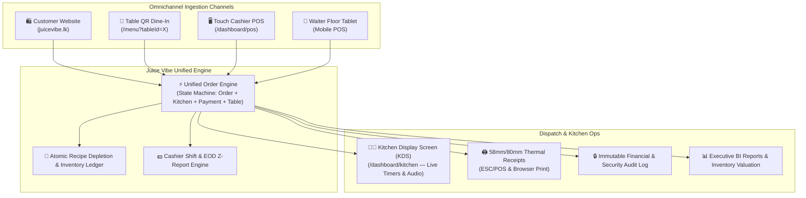

# 🛡️ JUICE VIBE PHASE 2: POS & RESTAURANT MANAGEMENT SYSTEM
## MASTER PRODUCT & TECHNICAL ARCHITECTURE SPECIFICATION

**Project:** Juice Vibe Digital Platform — Phase 2 Enterprise Restaurant Operating Platform  
**Client:** Juice Vibe Waskaduwa, Kalutara, Sri Lanka  
**Classification:** Master PRD, System Architecture & Engineering Specification  
**Document Version:** 2.0.0-PROD  
**Target Monorepo:** `juicevibeonline-code/juicevibe-platform` (`apps/web`, `apps/admin`, `apps/api`, `packages/*`)  
**Status:** `[ACTIVE IMPLEMENTATION ON BRANCH: feature/phase-2-pos]`

---

## 1. 🌟 EXECUTIVE OVERVIEW & ARCHITECTURAL FOUNDATION

### 1.1 Executive Summary
Phase 1 established the online customer storefront (`juicevibe.lk`), operations desk (`admin.juicevibe.lk`), and backend REST engine (`api.juicevibe.lk`).

**Phase 2 transforms Juice Vibe into an integrated, end-to-end restaurant operating platform.** It unifies **Counter Cashier POS**, **Kitchen Display System (KDS)**, **Table Floor Management**, **Multi-Tender Split Payments**, **Atomic Recipe-Driven Inventory Depletion**, **Supplier Purchase Orders**, **Cashier Shift Lifecycle & End-of-Day Z-Reports**, and **Business Analytics** into **one codebase, one database, and one order lifecycle**.



---

### 1.2 Core Architectural Principles

1. **ONE SYSTEM, ONE SOURCE OF TRUTH:** Orders originating from the website, table QR codes, or counter POS share the exact same PostgreSQL schema, inventory deductions, and reporting aggregation pipelines.
2. **ZERO CLIENT TRUST:** All item prices, modifier costs, 5% government taxes, service charges, and recipe deductions are strictly recalculated on the NestJS backend inside atomic database transactions (`prisma.$transaction`).
3. **FAIL-SAFE & CONCURRENCY RESILIENT:** Row-level locks and database transactions prevent race conditions during concurrent sales, coupon usage, and inventory depletion.
4. **TOUCH-FIRST ERGONOMICS:** Designed for 10"–15" touch screens (1366×768 to 1920×1080) with touch targets $\ge 44\text{px}$.

---

## 2. 🧩 PHASE 2 FUNCTIONAL MODULE SPECIFICATIONS

### MODULE A — COUNTER TOUCH POS (`/dashboard/pos`)
* **Touch Category Bar & High-Contrast Product Grid:** Tap to select, category filtering, search & barcode scanner ready.
* **Touch Modifier Modal:** Size/variant selection (Regular/Large), Add-ons (Chia seeds, Protein), Special kitchen notes ("No Sugar", "Extra Lime").
* **Active Ticket Ledger:** Instant quantity steppers (`-` / `+`), item voiding with reason prompt, subtotal, 5% tax, grand total in IBM Plex Mono.
* **Hold & Resume Ticket Queue:** Park tickets to serve next customer and resume in 1-click.
* **Fast Cash Tender Buttons:** Exact, LKR 1,000, LKR 2,000, LKR 5,000 with instant change calculation.

### MODULE B — MULTI-TENDER SPLIT PAYMENTS
* **Split Tender Support:** Settle an order across multiple methods (e.g. LKR 1,000 Cash + LKR 1,500 Visa/MasterCard).
* **Exact Math Validation:** Backend rejects payment if $\sum \text{Tender Amounts} < \text{Order Total}$.
* **Transaction Ledger:** Records each payment portion into `PaymentTransaction` linked to the `Order`.

### MODULE C — THERMAL RECEIPTS (58mm & 80mm ESC/POS)
* **Formatted Thermal Canvas:** Printable layout with Juice Vibe branding, branch address, phone, table number, cashier name, itemized bill, tax breakdown, amount tendered, and change due.
* **Direct Print Engine:** Supports browser direct print (`window.print()`) and raw ESC/POS byte buffers for network thermal printers.
* **Duplicate Tagging:** Reprinted receipts print `*** REPRINT / DUPLICATE COPY ***` to prevent cashier fraud.

### MODULE D — KITCHEN DISPLAY SYSTEM (KDS — `/dashboard/kitchen`)
* **Real-Time WebSockets Sync:** New tickets appear in < 500ms accompanied by an audio chime alert.
* **Aging Color Thresholds:**
  - **Green (0 – 7 mins):** Normal queue.
  - **Amber (8 – 14 mins):** Approaching preparation SLA.
  - **Flashing Red (> 15 mins):** Overdue order requiring immediate kitchen attention.
* **Ticket Bump Pipeline:** `NEW` ➔ `PREPARING` ➔ `READY` ➔ `COMPLETED` with a 60-second undo recall buffer.

### MODULE E — TABLE & FLOOR PLAN MANAGEMENT
* **Interactive Floor Canvas:** Visual table grid showing real-time states: `AVAILABLE` (Green), `OCCUPIED` (Red), `BILL_REQUESTED` (Yellow), and `RESERVED` (Blue).
* **Table Merging & Transfers:** Move active orders between tables or merge multiple tables for large parties into a single master bill.

### MODULE F — UNIFIED ORDER STATE MACHINE
```
ORDER STATUS:    pending ──► confirmed ──► preparing ──► ready ──► completed
                     │                         │
                     └──► cancelled ◄──────────┘

KITCHEN STATUS:  new ──────► accepted ───► preparing ──► ready ──► completed

PAYMENT STATUS:  pending ──► paid ───────► refunded / partially_refunded
                     │
                     └──► failed
```

### MODULE G & H — RECIPES & ATOMIC INVENTORY LEDGER
* **Multi-Ingredient Recipes:** Maps menu items and variants to raw inventory ingredients with yield/wastage factors.
* **Atomic Deduction:** On order confirmation, raw materials (milk, avocado, fruit, sugar, cups) are decremented in a PostgreSQL transaction and recorded in `InventoryTransaction` (`PURCHASE`, `SALE`, `WASTAGE`, `ADJUSTMENT`, `RETURN`).

### MODULE K & L — CASHIER SHIFTS & Z-REPORTS
* **Shift Drawer Session:** Cashier enters opening cash float to activate POS terminal.
* **End-of-Day Reconciliation Formula:**
  $$\text{Expected Cash} = \text{Opening Float} + \text{Cash Sales} - \text{Cash Refunds}$$
  $$\text{Variance} = \text{Counted Cash} - \text{Expected Cash}$$
* **Z-Report Generation:** Prints complete shift summary (gross sales, cash/card breakdown, discounts, tax, variance).

### MODULE Q — IMMUTABLE AUDIT LOGGING
* **Audit Trail:** Logs user ID, role, action, target entity, JSON delta (before vs after), IP address, and timestamp for price overrides, item voids, order cancellations, refunds, and shift closures.

---

## 3. 🗄️ DATABASE ARCHITECTURE (PRISMA SCHEMA DELTA)

```prisma
// Phase 2 Enums
enum OrderSource { CUSTOMER_WEB, COUNTER_POS, QR_TABLE, WAITER_TAB, DELIVERY_AGGREGATOR }
enum KitchenStatus { new, accepted, preparing, ready, completed }
enum ShiftStatus { open, closed }
enum InventoryTxType { PURCHASE, SALE, WASTAGE, ADJUSTMENT, TRANSFER, RETURN }
enum TableState { available, occupied, bill_requested, paying }

// Phase 2 New Models
model PaymentTransaction {
  id             String        @id @default(cuid())
  orderId        String
  method         PaymentMethod
  amount         Float
  status         PaymentStatus @default(paid)
  cardLast4      String?
  transactionRef String?
  cashTendered   Float?
  changeGiven    Float?
  createdAt      DateTime      @default(now())
  order          Order         @relation(fields: [orderId], references: [id], onDelete: Cascade)
}

model CashierShift {
  id           String      @id @default(cuid())
  cashierId    String
  openingFloat Float
  closingCash  Float?
  expectedCash Float?
  variance     Float?
  status       ShiftStatus @default(open)
  openedAt     DateTime    @default(now())
  closedAt     DateTime?
  notes        String?
  cashier      User        @relation(fields: [cashierId], references: [id])
  orders       Order[]
}

model Recipe {
  id            String             @id @default(cuid())
  menuItemId    String             @unique
  yieldServings Float              @default(1.0)
  isActive      Boolean            @default(true)
  createdAt     DateTime           @default(now())
  updatedAt     DateTime           @updatedAt
  menuItem      MenuItem           @relation(fields: [menuItemId], references: [id], onDelete: Cascade)
  ingredients   RecipeIngredient[]
}

model RecipeIngredient {
  id              String        @id @default(cuid())
  recipeId        String
  inventoryItemId String
  quantity        Float
  wastageFactor   Float         @default(0.0)
  recipe          Recipe        @relation(fields: [recipeId], references: [id], onDelete: Cascade)
  inventoryItem   InventoryItem @relation(fields: [inventoryItemId], references: [id])
}

model InventoryTransaction {
  id              String          @id @default(cuid())
  inventoryItemId String
  type            InventoryTxType
  quantity        Float
  unitCost        Float?
  referenceId     String?
  notes           String?
  actorId         String?
  createdAt       DateTime        @default(now())
  inventoryItem   InventoryItem   @relation(fields: [inventoryItemId], references: [id])
}

model AuditLog {
  id         String   @id @default(cuid())
  actorId    String
  actorRole  String
  action     String
  entity     String
  entityId   String
  beforeData Json?
  afterData  Json?
  ipAddress  String?
  orderId    String?
  createdAt  DateTime @default(now())
  actor      User     @relation(fields: [actorId], references: [id])
  order      Order?   @relation(fields: [orderId], references: [id])
}
```

---

## 4. 🔌 REST API ENDPOINT CATALOG

| Endpoint | Method | Role | Description |
| :--- | :--- | :--- | :--- |
| `/api/pos/orders` | `POST` | `cashier, manager, admin` | Creates POS order with server-side validation & WS broadcast |
| `/api/pos/orders/:id/split-pay` | `POST` | `cashier, manager, admin` | Settles order with multi-tender split transactions |
| `/api/pos/orders/:id/void-item` | `POST` | `manager, admin` | Voids line item with mandatory reason and audit log |
| `/api/pos/orders/:id/kds-status`| `PATCH`| `kitchen, manager, admin` | Advances kitchen preparation status (`new` ➔ `ready`) |
| `/api/pos/shifts/open` | `POST` | `cashier, manager, admin` | Starts cashier shift session with opening float |
| `/api/pos/shifts/:id/close` | `POST` | `cashier, manager, admin` | Closes shift, records cash count, variance & Z-Report |
| `/api/pos/shifts/active` | `GET` | `cashier, manager, admin` | Retrieves current logged-in cashier's active shift |
| `/api/pos/shifts/:id/z-report` | `GET` | `cashier, manager, admin` | Retrieves Z-Report breakdown for printing |
| `/api/pos/tickets` | `GET` | `cashier, manager, admin` | Returns active tickets for cashier ledger |

---

## 5. 📅 PHASE 2 RELEASE ROADMAP

* **Phase 2A (Delivered):** Touch Cashier POS, Multi-Tender Split Payments, Cashier Shifts, Thermal Receipts, and Schema Extensions.
* **Phase 2B (Current):** Kitchen Display System (KDS) with Real-Time Aging Timers, Audio Chimes, and Bump Workflows.
* **Phase 2C:** Recipe Engine UI, Automated Inventory Stock Deductions, and Supplier Purchase Orders.
* **Phase 2D:** Executive BI Reports, Shift Analytics Dashboard, and Pilot Production Go-Live.
