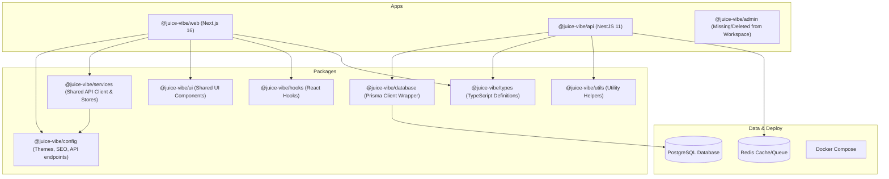
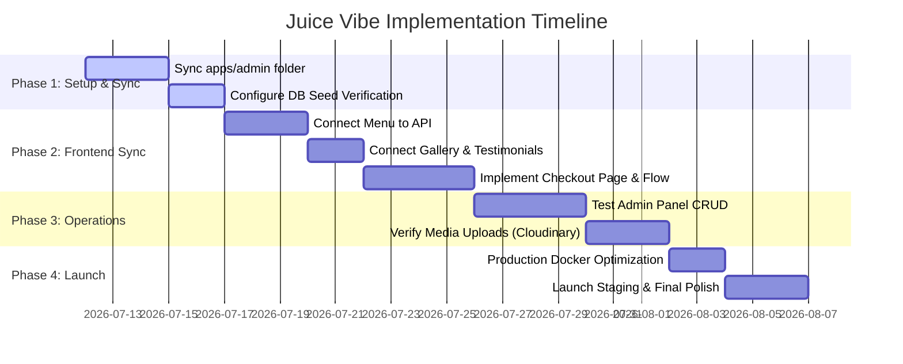

# Status & Codebase Analysis Report
## Juice Vibe Cafe - Official Platform Review

This document provides a comprehensive review and analysis of the ongoing development status of the **Juice Vibe** digital platform. Juice Vibe is a premium tropical juice café based in Bentota, Sri Lanka, offering a menu of fresh organic juices, smoothies, shakes, coffee, burgers, and mocktails.

The digital ecosystem consists of a frontend web application (customer-facing site), a backend API service, and a planned admin portal, all organized as a monorepo.

---

## 1. System Architecture & Tech Stack

The project is structured as a Monorepo managed using **Turborepo** and **pnpm workspaces**. This setup isolates applications and shares configuration/logic seamlessly.



### Technology Breakdown

| Component | Framework / Technology | Purpose |
| :--- | :--- | :--- |
| **Monorepo Manager** | Turborepo + pnpm (v10.7.0) | Orchestrating workspace builds, caching, and task runs |
| **Frontend Web** | Next.js 16.2.10 + React 19.2.4 | Client-facing portal, landing pages, menu search, and cart |
| **Backend API** | NestJS 11.0.0 | REST API, auth routing, orders, settings, and business analytics |
| **Styling** | Tailwind CSS v4 + Framer Motion | High-fidelity, smooth interactive elements and custom aesthetics |
| **State Store** | Zustand v5.0.0 | Lightweight local cart and UI state management |
| **Database ORM** | Prisma ORM | Schema-first database mapping and PostgreSQL queries |
| **Caching/Jobs** | Redis (via Docker) | Prepared for session caching, token blacklists, or task queues |
| **Containerization** | Docker + Docker Compose | Standardizing environment setup for databases and apps |

---

## 2. Database Schema & Architecture (`schema.prisma`)

The system's database schema is designed in PostgreSQL using Prisma. It is highly structured and caters to full restaurant management capabilities:

*   **Users & Roles (`User`, `UserRole`):** Supports roles like `admin`, `manager`, `cashier`, `kitchen`, `editor`, and `customer`. It includes fields for refresh tokens and email verification.
*   **Customer Profiles (`Customer`, `Address`):** Handles billing/shipping addresses, loyalty points tracker (`loyaltyPoints`), and order history aggregates (`totalSpent`, `totalOrders`).
*   **Menu Catalog (`Category`, `MenuItem`, `ItemVariant`, `AddOn`):**
    *   `MenuItem` supports slugs (for SEO URLs), price, category mappings, popu/featured flags, ingredients, and tags.
    *   `ItemVariant` manages size/flavor options (e.g. Small, Large) with positive/negative price adjustments.
    *   `AddOn` tracks customizations like adding BOBA (+100 LKR) or extra cheese.
*   **Orders & Items (`Order`, `OrderItem`):** Manages order numbers, customer details, calculated amounts (subtotal, tax, discount, delivery fee), order types (`pickup`, `delivery`, `dine_in`), and statuses (`pending`, `preparing`, `ready`, `completed`, `cancelled`).
*   **Promotional Tools (`Coupon`, `Review`, `Testimonial`, `NewsletterSubscriber`):** Supports percentage/fixed coupons with minimum order amount limits and expiration tracking.
*   **Operational Modules (`Employee`, `InventoryItem`, `Setting`):** Tracks kitchen staff payroll settings, minimum inventory levels (`minStockLevel` with unit counts), and global site variables (currencies, tax rates).

---

## 3. Component Progress Review

### 🟢 Backend API (`apps/api`)
The NestJS backend API is in an **advanced, feature-complete state** for standard operations.
*   **Security & Guard Rails:** Integrated with `helmet` for HTTP headers, `@nestjs/throttler` for rate-limiting, and standard CORS configured to accept incoming traffic from the frontend (`localhost:3000`) and admin (`localhost:3001`) addresses.
*   **Validation:** Uses `class-validator` and `class-transformer` globally to ensure clean incoming payloads.
*   **API Docs:** Swagger UI is fully integrated and served at `/api/docs`.
*   **Completed Modules:**
    *   `Auth`: Access and Refresh token logic with Passport-JWT.
    *   `Menu`: Full Categories and MenuItem management controllers.
    *   `Orders`: Order generation, type assignment, state lifecycle modification.
    *   `Analytics`: High-level summaries (sales, popular items) for management.
    *   `Gallery`: Gallery images and album management.
    *   `Settings`: CRUD settings with overrides.

### 🟡 Frontend Website (`apps/web`)
The client website has a **gorgeous premium aesthetic** matching Juice Vibe's branding (Poppins/Inter fonts, custom gradients, green/orange/yellow tropical vibes, and interactive micro-animations). However, it is structurally incomplete regarding integration:
*   **Pages Developed:** Homepage (`page.tsx`), Menu (`menu/page.tsx`), Gallery (`gallery/page.tsx`), and layout controls.
*   **State Store:** Dynamic client-side cart built using Zustand. Automatically handles additions, updates, quantities, and persists items to LocalStorage.
*   **CRITICAL INTEGRATION GAP:** The frontend pages are currently powered entirely by **static mock data** located in `apps/web/src/data/` (such as `menu.ts` and `gallery.ts`). They are **not** calling the backend API endpoints through the shared services layer.
    *   *Example:* The menu page is rendering items from local arrays instead of calling `menuService.getMenuItems()` from the packages services layer.

### 🔴 Admin Portal (`apps/admin`)
There is a **notable directory gap** in the workspace:
*   **The Issue:** The physical folder `apps/admin` is **not present** in the workspace directories, even though it is referenced in:
    *   `pnpm-lock.yaml` (dependency records)
    *   `Dockerfile` (build steps targeting `apps/admin/package.json`)
    *   `apps/api/src/main.ts` (CORS policies looking at `localhost:3001` or `process.env.ADMIN_URL`)
    *   *Browser Context:* The active browser viewport references `http://localhost:3001/menu [Juice Vibe Admin]`, suggesting an admin panel is either being run from another workspace folder or a separate repository.
*   **The Resolution:** The admin panel code must be restored or located in order to synchronize it with the monorepo config.

---

## 4. Key Code Gaps & Recommendations

### Gap 1: Frontend API Integration
The client website must transition from reading `src/data/` to reading from `@juice-vibe/services`.
*   **Action:** Rewrite the `useEffect` hooks in `apps/web/src/app/menu/page.tsx` and `apps/web/src/app/gallery/page.tsx` to pull data dynamically from the API.
*   **Example Integration Pattern:**
    ```typescript
    import { menuService } from "@juice-vibe/services";
    // Fetch from backend
    const categories = await menuService.getCategories();
    const items = await menuService.getMenuItems();
    ```

### Gap 2: Sync Missing Admin App (`apps/admin`)
Ensure the codebase contains the admin dashboard code that runs on port 3001.
*   **Action:** Locate the `apps/admin` folder. If it was accidentally deleted, restore it from Git history. If it is located in a different repository, copy it into `apps/admin` and link it back to the pnpm workspace.

### Gap 3: Media Upload Pipeline
The schema defines `images` as strings, and the backend has dependencies for `cloudinary` and `multer`.
*   **Action:** Confirm that the backend environment variables have credentials for Cloudinary, and configure the file-upload pipeline in NestJS so that admin managers can successfully upload menu photos and gallery images.

### Gap 4: Complete the Checkout & Payment Flow
While the cart Zustand store is ready, there is no checkout page or payment integration currently hooked up on the frontend.
*   **Action:** Create a `/checkout` route inside `apps/web/src/app`. Integrate it with `orderService.createOrder()` and hook up payment selection (Cash on Delivery or payment gateways like Payhere/Stripe).

---

## 5. Development Roadmap

To bring the Juice Vibe digital platform to a release-ready state, we recommend executing the following development phases:



### Next Immediate Action Items:
1. **Restore or Mount `apps/admin`:** Resolve why this folder is absent from the workspace to make sure all applications build successfully.
2. **API Integrations:** Replace static arrays in `apps/web/src/data/` with backend calls.
3. **Database Connectivity:** Verify that PostgreSQL and Prisma migrations run smoothly on local and staging databases.
